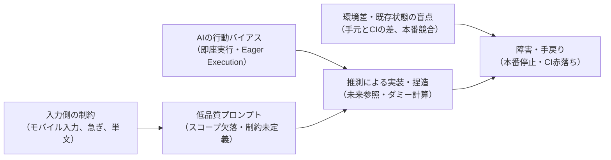
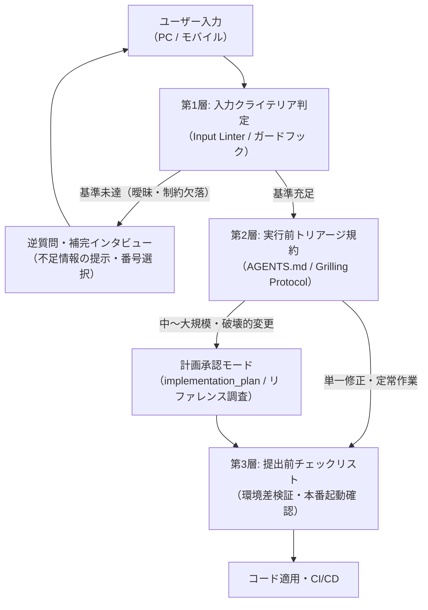
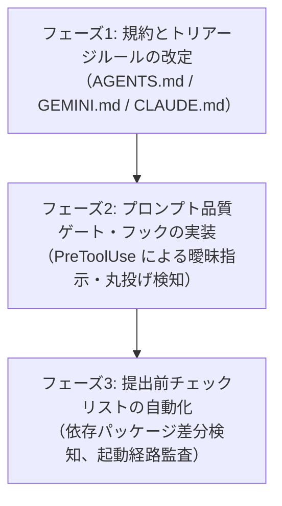

# プロンプト品質ゲート（Prompt Quality Gate）設計・導入プラン

本ドキュメントは、ブログ記事（[AI Agentを利用した開発におけるプロンプトの重要性やポイントについて](https://oranie.hatenablog.com/entry/2026/09/16/120213)）における課題認識に基づき、**「曖昧・不足のあるプロンプトをAIがそのまま受け入れて暴走・手戻りを起こす現象」を人間側の注意力だけに頼らず、仕組み（ゲートウェイ・規約・検証手順）で防止・改善するための設計計画**です。

---

## 1. 解決すべき課題と構造的要因

ブログ記事で指摘された手戻りの実態を分析すると、以下の3つの構造的要因が重なっていました。

1. **入力側の制約（作業環境と心理的バイアス）**:
   - 移動中やモバイル端末からの入力では、長文や厳密な制約（スコープ、エッジケース、禁止事項）を記述しきれず、「全部治ってるの？」「はい続けて下さい」といった単文になりやすい。
   - 「AIがよしなにやってくれるはず」という期待が、指示の省略を招く。
2. **AIエージェントの行動バイアス（Eager Execution / 即座実行の罠）**:
   - 現在のLLMエージェントは「指示を受けたら直ちにコードを生成し、コマンドを実行する」行動バイアスを持つ。
   - 情報が欠落していても、「確認して立ち止まる」のではなく「勝手に推測で埋めて走る」ため、未来データ参照（パターン③）や数値捏造、アサーション欠落テストを生成してしまう。
3. **指示側では防げない実装側の確認不足（パターン⑤）**:
   - 指示が具体的であっても、AIが「手元の環境とCIの差」「本番での複数リビジョン競合」を確かめずに提出してしまう。

**結論**: 人間に「常に完璧なプロンプトを書け」と求める運用は破綻します。**「未完成・曖昧なプロンプトが入力されたとき、AIが自律的に立ち止まり、不足情報を特定して聞き返す仕組み（品質ゲート）」**が必要です。

---

## 2. プロンプト品質ゲートの3層防御モデル

入力から実行までのパイプラインに、以下の3つの防御線を構築します。

---

### 第1層: 入力クライテリア自動判定（Input Linter / ガードフック）

ユーザーが入力したプロンプトを即座にツール実行に渡さず、以下の「5大受入基準（Definition of Input: DoI）」に照らして機械的に検証します。

#### 5大受入基準（DoI）
| 判定項目 | 検出するアンチパターン | 期待される入力水準 |
|---|---|---|
| **1. スコープの特定** | 「全部」「あれ」「いい感じに直して」 | 対象ファイル、ディレクトリ、関数名が名指しされているか |
| **2. ドメイン制約・フォールバック** | 「スコアを計算して」「勝敗を予想して」 | データ欠損時の扱い（NaN / 中立値）、発走前データ限定の明記 |
| **3. 新規技術のリファレンス** | 公式マニュアルを要する新API・クラウド設定 | 事前調査メモ（`docs/references/`）の参照または調査指示の有無 |
| **4. 完了条件（DoD）の明示** | 「マージして」「やっといて」 | テスト合格、CI通過、画面キャプチャ確認等の終了判定条件 |
| **5. 選択の丸投げ検知** | 「続けて」「まかせる」「適当に」 | 直前の選択肢に対する番号や方針の明示 |

#### 実装方法: Pre-Prompt 判定スクリプト
- Claude Code / Antigravity のプロンプト受付フック（またはシステムプロンプトの最上流）に判定ロジックを組み込みます。
- 基準を満たさないプロンプトを検知した場合、**AIのツール呼び出し（`run_command`, `write_to_file` 等）を一時的にロック**し、以下のテンプレートでユーザーに逆質問します。

> **【プロンプト品質ゲートによる確認】**
> 入力された指示に以下の前提条件が不足しています。推測による誤実装を防ぐため、ご指定ください。
> 1. 対象ファイル/ディレクトリ: （候補: A or B）
> 2. データ欠損時の扱い: （1: 欠損値NaNとする / 2: 全体平均値で補正する）
> 3. 完了条件: （1: 単体テスト実行まで / 2: CI確認まで）
> ※番号でお答えいただくだけで進行できます。

---

### 第2層: 実行前トリアージプロトコル（AGENTS.md への規約組み込み）

AIエージェントの基本行動規範（`AGENTS.md`）に、**「推測による即座実行（Eager Execution）の禁止」**をルールとして追加します。

#### 新設規約: Eager Execution 禁止ルール
1. **未定義領域の勝手な補完の禁止**:
   指示に含まれていないドメイン制約（スコアリング方式、脚質判定基準、例外処理等）を、AIが手元の都合のいいデータやダミー数式で補完して実装することを禁止する。
2. **計画モードへの強制引き上げ**:
   以下の条件に合致する指示を受領した場合、AIはコード生成を行わず、必ず `implementation_plan.md` または逆質問を提示してユーザーの承認を得ること。
   - 変更対象が 3 ファイル以上に跨がる場合
   - 外部ライブラリ、GCPリソース、Terraform、GitHub Actions の設定変更
   - 予測モデルの特徴量・評価ロジックの変更
3. **選択肢提示後の「続けて」に対する自律停止**:
   選択肢を提示した直後にユーザーから「続けて」「はい」等の曖昧な返答があった場合、全件実行せず、第1推奨案を明示した上で「案1（○○）で進めてよろしいですか？」と確認を挟むこと。

---

### 第3層: 提出前セルフチェック（パターン⑤ 実装側確認不足の防止）

指示側に問題がなくても発生する「パターン⑤（手元とCIの差、本番競合、生成物の初歩的破綻）」を防ぐため、AIが完了報告を出す前に機械的に回す自己検査手順を義務付けます。

#### 提出前チェックリスト
1. **実行環境差の検査**:
   - 新規 import したライブラリが `requirements.lock.txt` に存在するか。
   - ローカルのテスト環境（`.venv`）に余分に入っているパッケージに依存していないか。
2. **起動シーケンスの整合性検査**:
   - 変更したコードがWebコンテナの起動経路（ヘルスチェック完了前）を通る場合、ブロッキング処理や重いDB操作が含まれていないか。
   - デプロイ時の新旧コンテナ重複起動で、単一書き込みストレージ（SQLite等）への衝突が発生しないか。
3. **生成物のドメイン整合性検査**:
   - 画像生成やUI変更の場合、表示項目に初歩的な破綻（選手名欄にチーム名が入る、ポジションと無関係なパラメータの重複等）がないかを出力直後に自動検証する。

---

## 3. モバイル・簡易入力支援（ショートコード・入力テンプレート）

モバイル環境からの入力負荷を軽減し、短文でも必要な制約が自然に揃う仕組みを用意します。

### スラッシュコマンド（ショートコード）の導入
チャット冒頭に以下のプレフィックスを付けることで、AI側があらかじめ定義された型で応答・展開します。

| コマンド | 展開される挙動 | 想定用途 |
|---|---|---|
| `/fix [対象] [現象]` | 影響範囲の事前調査メモを作成し、修正案を1つ提示して承認を待つ | ピンポイントのバグ修正 |
| `/feat [機能名]` | リファレンス調査 → 実装計画書（DoD付き）を作成し承認を待つ | 新機能の追加 |
| `/verify [対象]` | 単体テスト、環境差チェック、起動確認を実行してログを要約 | 変更後の動作確認 |
| `/triage` | 未解決課題の一覧を出し、着手すべき優先度順に番号付きで提示 | 作業方針の決定 |

### モバイル向け番号選択UI
AIからの確認質問は、自由記述を求めず**「1, 2, 3 の番号を選ぶだけ」**のフォーマットに統一します。これにより、スマホから「1」と送信するだけで曖昧さを排除した指示が完結します。

---

## 4. 導入ロードマップ

### フェーズ1: 規約とトリアージルールの改定（即時適用）
- `AGENTS.md` に「Eager Execution（推測による即座実行）の禁止」と「5大受入基準（DoI）」を追加。
- 曖昧な指示に対して立ち止まる基準（3ファイル以上の変更、ドメインロジック、インフラ設定）を明文化。

### フェーズ2: プロンプト品質ゲート・フックの実装
- `.agents/hooks/` および `.claude/hooks/` に、単文指示や選択放棄（「続けて」「全部」等）を検知して停止するフックを追加。
- 不足情報を補うための「番号選択式逆質問テンプレート」を実装。

### フェーズ3: 提出前チェックリストの自動化
- CI同等テスト（`scripts/ci_like_test.sh`）に、依存ロックファイルとの整合性チェックを追加。
- デプロイ前の起動確認ステップを整備。
